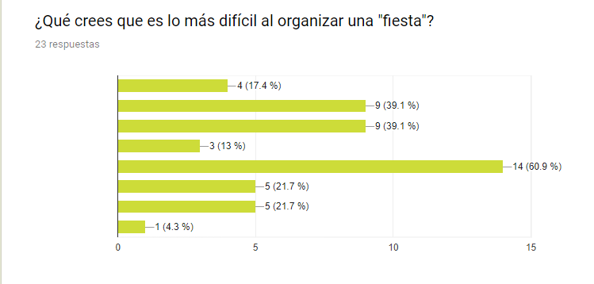
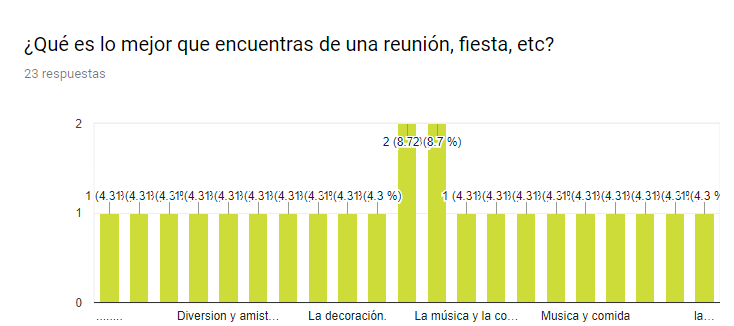
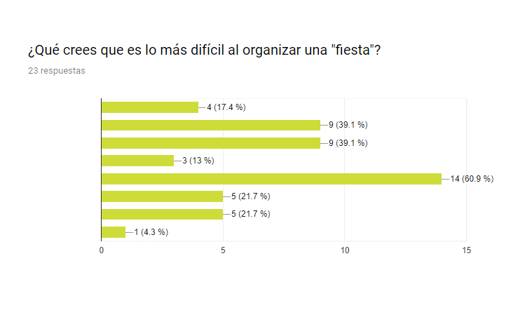
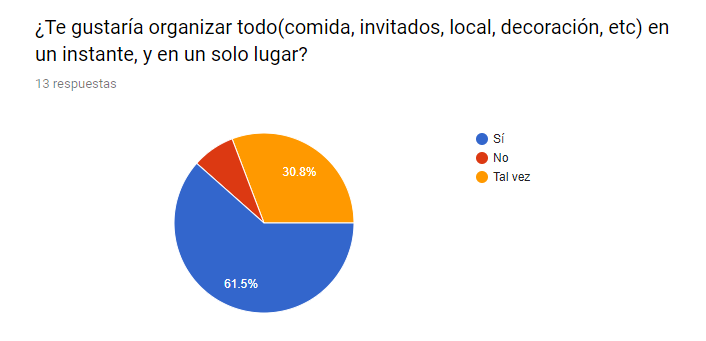
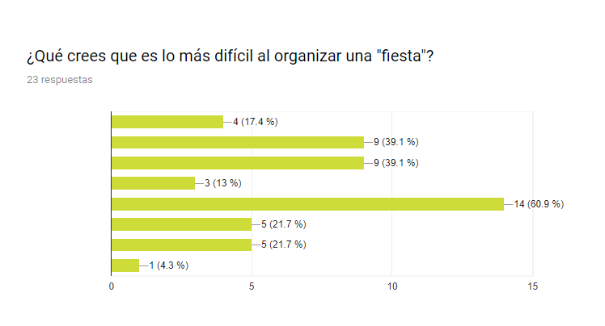
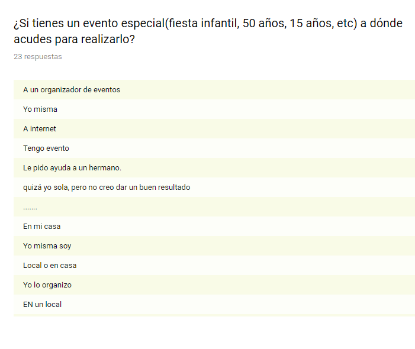
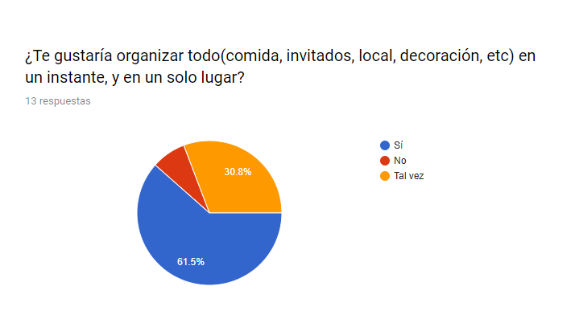
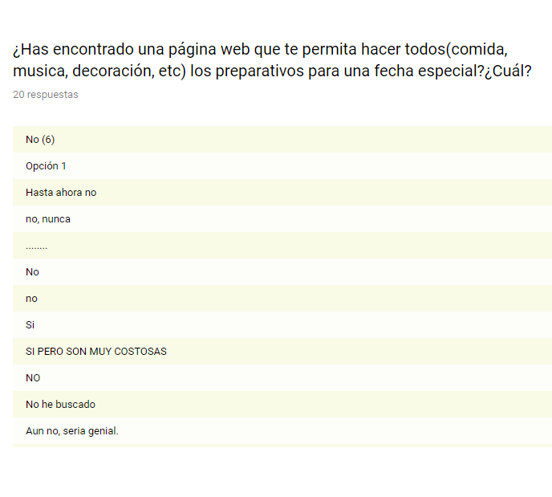
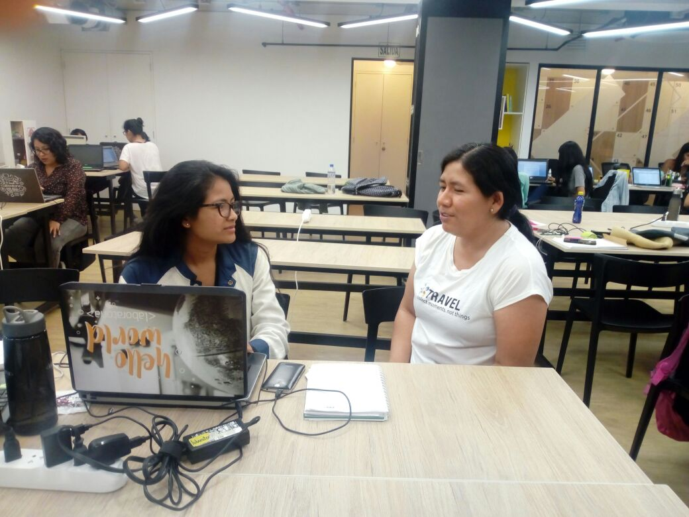

- Track: Especialización UX Designer
- Curso: Aplica lo aprendido
- Unidad: Herramientas aprendidas
- Estudiante: Angelica Villalobos 

***

* RETO LIBRE

Durante este sprint y durante lo que queda del bootcamp deberás trabajar individualmente en diseñar o rediseñar un producto digital.

Si tienes una idea de un producto que te gustaría probar, lo podrás hacer. Podrás identificar y conocer a tus usuarios y hacer las pruebas necesarias para poder validar tu idea.

Por otro lado, si es que se te hace difícil pensar en una idea para un producto podrías escoger un producto que ya existe pero que crees que necesita mejorar como un portal de venta de entradas para conciertos, un portal de venta de flores o un ecommerce.

El único requisito es que sea un producto en el que puedas aplicar todo lo aprendido hasta ahora y puedas demostrar todo tu potencial.

***

## Research

Realicé encuestas y entrevistas presenciales, para saber un poco más del usuario al momento de realizar algun evento importante.
<!--  -->

<!--  -->

### Entrevistas presenciales

### Síntesis

Mediante la técnica del Affinity Mapping podemos procesar de mejor manera los insights y así pude hallar a encontrar los problemas principales.

- Mucho de los usuarios, no sabean a donde acudir principalmente.
- Sienten que lo mas dificil al organizar una fiesta es la música, comida y dxecoración.
- A la mayoria le gustaria tener un aplicativo web para que pueda ser mucho más rápido.

#### User Personas

Después de definir el problema creamos un arquetipo sobre nuestro ususario con todos los datos recogidos.

### Served Persona

### Negative Person

#### Problem statements & How might we? & what if...?

### Served Persona

### Negative Person

#### Problem statements & How might we? & what if...?
-  Carlos NECESITA una manera segura PARA comprar pasajes online.
-  Carlos QUISIERA que el proceso de compra PARA realizar compras online.

### Conceptualización

Es aquí donde empezamos a pensar en qué funcionalidad debería tener nuestro MPV.

Aquí algunas ideas.

**Benchmarking**

**Brainstorm**

**Benchmarking**

**Brainstorm**

Es así que se crea el story board para este user person

**Guión Literario**

María, se siente estresada debido a que sabe que su madre en pocos días cumplirá 50 años, solo le faltan 2 días exactamente y no sabe a donde acudir primero porque desea que sea especial e inolvidable.

Ella estuvo buscando información por internet, tenia ideas, mas no contaba con el tiempo disponible para realizarlo, pero recuerda que su Manuel le comentó sobre una página *SpecialDay* en donde puede organizar el catering, música, decoración y más.

María no lo pensó más y decide ingresar a SpecialDay y encuentra un portal dinámico y muy confiable y fácil de usar. 

 María mas tranquila empezo hacer sus pedidos y exactamentetodo estuvo listo para el dia tan especial para su mami, 

Llegó el día, todo salió muy bien.

# Special day
Muchos de nosotros hemos estado involucrados realizando un día especial, ya sea un cumpleaños, un bautizo, matrimonio, entre otros eventos especiales; todos nos esforzamos en que sea un día único e inolvidable, es por ello que he creado a Special day, una aplicación web que esta diseñada para personas que muchas veces han querido organizar un evento y no les alcanza el tiempo o no saben a donde principalemente acudir y que más chevere que poder realizarlo en un solo lugar en un solo momento y te evitará el estar acercandose a un organizador de eventos,porque te permitirá elegir el lugar, el realizar tus invitaciones, escoger música.

